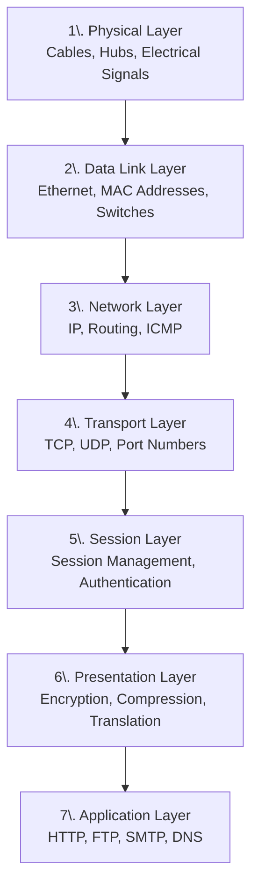

# OSI (Open Systems Interconnection)

## 1. Physical layer

- Hardware components
- Transmission media (cables, fiber optics, wireless)
- Electrical signals

## 2. Data Link layer

- MAC addresses
- Switches
- Error detection and correction

More details about ARP, see [ARP diagram](./arp-flow-diagram.md).

## 3. Network layer

- IP addressing (IPv4, IPv6)
- Routing (routers, routing protocols)
- Packet forwarding
- ICMP (ping, traceroute)

More details about Network layer, see [Network layer notes](./osi-network-layer.md).

## 4. Transport layer

- TCP (connection-oriented, reliable)
- UDP (connectionless, faster, less reliable)
- Port numbers (well-known ports, ephemeral ports)
- Flow control and congestion control

## 5. Session layer

- Session establishment, maintenance, termination
- Authentication and authorization
- Session checkpoints and recovery
- RPC (Remote Procedure Call)
- SCP (Secure Copy Protocol)
- Socket programming (sockets API)

## 6. Presentation layer

- Data format translation (e.g., ASCII to EBCDIC)
- Data encryption and decryption (e.g., SSL/TLS)
- Data compression (e.g., gzip)

## 7. Application layer

- Application protocols (HTTP, FTP, SMTP, DNS)
- Web browsers and servers
- Email clients and servers
- File transfer applications
- DNS resolution
