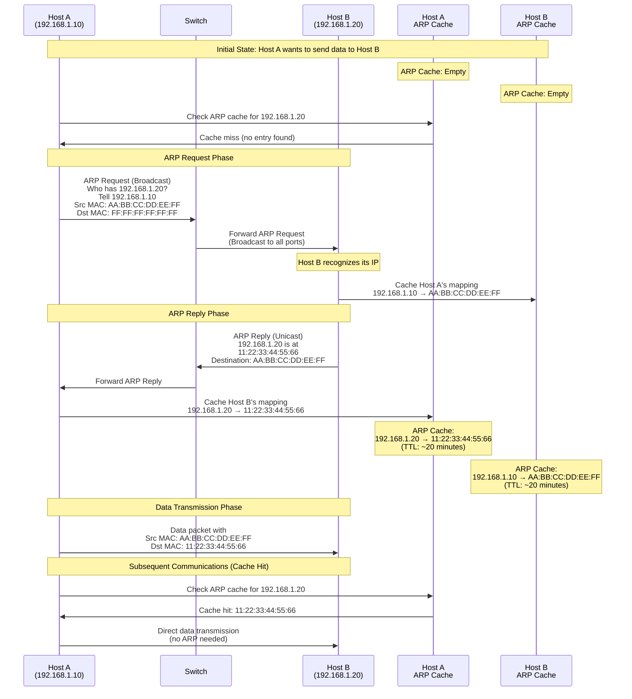
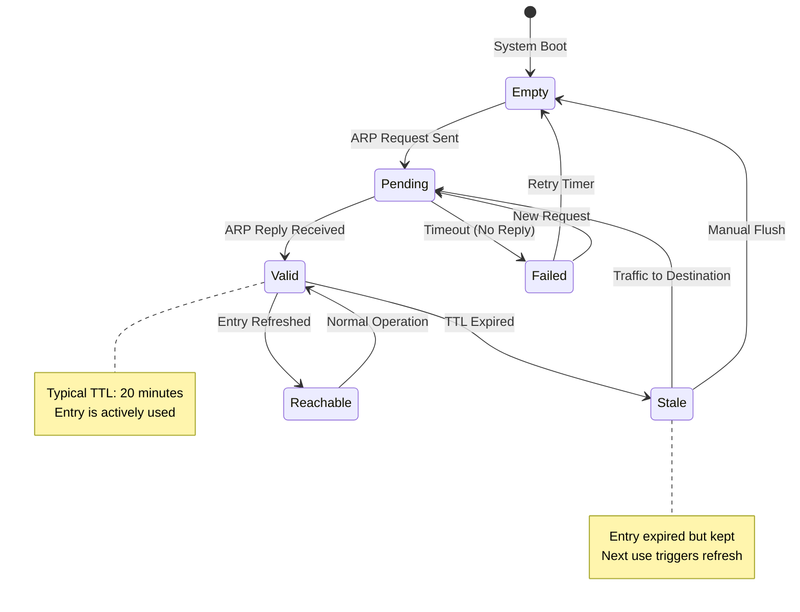
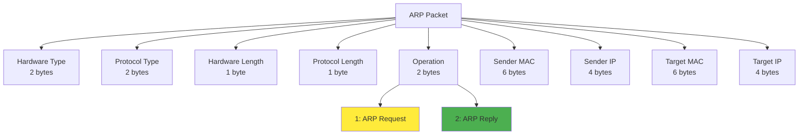

# ARP Flow and Cache Diagram

```mermaid
sequenceDiagram
    participant H1 as Host A<br/>(192.168.1.10)
    participant SW as Switch
    participant H2 as Host B<br/>(192.168.1.20)
    participant AC1 as Host A<br/>ARP Cache
    participant AC2 as Host B<br/>ARP Cache

    Note over H1,AC2: Initial State: Host A wants to send data to Host B
    Note over AC1: ARP Cache: Empty
    Note over AC2: ARP Cache: Empty

    H1->>AC1: Check ARP cache for 192.168.1.20
    AC1->>H1: Cache miss (no entry found)
    
    Note over H1,H2: ARP Request Phase
    H1->>SW: ARP Request (Broadcast)<br/>Who has 192.168.1.20?<br/>Tell 192.168.1.10<br/>Src MAC: AA:BB:CC:DD:EE:FF<br/>Dst MAC: FF:FF:FF:FF:FF:FF
    SW->>H2: Forward ARP Request<br/>(Broadcast to all ports)
    
    Note over H2: Host B recognizes its IP
    H2->>AC2: Cache Host A's mapping<br/>192.168.1.10 → AA:BB:CC:DD:EE:FF
    
    Note over H1,H2: ARP Reply Phase
    H2->>SW: ARP Reply (Unicast)<br/>192.168.1.20 is at<br/>11:22:33:44:55:66<br/>Destination: AA:BB:CC:DD:EE:FF
    SW->>H1: Forward ARP Reply
    
    H1->>AC1: Cache Host B's mapping<br/>192.168.1.20 → 11:22:33:44:55:66
    
    Note over AC1: ARP Cache:<br/>192.168.1.20 → 11:22:33:44:55:66<br/>(TTL: ~20 minutes)
    Note over AC2: ARP Cache:<br/>192.168.1.10 → AA:BB:CC:DD:EE:FF<br/>(TTL: ~20 minutes)
    
    Note over H1,H2: Data Transmission Phase
    H1->>H2: Data packet with<br/>Src MAC: AA:BB:CC:DD:EE:FF<br/>Dst MAC: 11:22:33:44:55:66
    
    Note over H1,H2: Subsequent Communications (Cache Hit)
    H1->>AC1: Check ARP cache for 192.168.1.20
    AC1->>H1: Cache hit: 11:22:33:44:55:66
    H1->>H2: Direct data transmission<br/>(no ARP needed)
```

## ARP Cache States

```mermaid
stateDiagram-v2
    [*] --> Empty: System Boot
    
    Empty --> Pending: ARP Request Sent
    Pending --> Valid: ARP Reply Received
    Pending --> Failed: Timeout (No Reply)
    
    Valid --> Stale: TTL Expired
    Valid --> Reachable: Entry Refreshed
    
    Stale --> Pending: Traffic to Destination
    Stale --> Empty: Manual Flush
    
    Failed --> Empty: Retry Timer
    Failed --> Pending: New Request
    
    Reachable --> Valid: Normal Operation
    
    note right of Valid
        Typical TTL: 20 minutes
        Entry is actively used
    end note
    
    note right of Stale
        Entry expired but kept
        Next use triggers refresh
    end note
```

## ARP Packet Structure

```mermaid
graph TD
    A[ARP Packet] --> B[Hardware Type<br/>2 bytes]
    A --> C[Protocol Type<br/>2 bytes]
    A --> D[Hardware Length<br/>1 byte]
    A --> E[Protocol Length<br/>1 byte]
    A --> F[Operation<br/>2 bytes]
    A --> G[Sender MAC<br/>6 bytes]
    A --> H[Sender IP<br/>4 bytes]
    A --> I[Target MAC<br/>6 bytes]
    A --> J[Target IP<br/>4 bytes]
    
    F --> F1[1: ARP Request]
    F --> F2[2: ARP Reply]
    
    style F1 fill:#ffeb3b
    style F2 fill:#4caf50
```